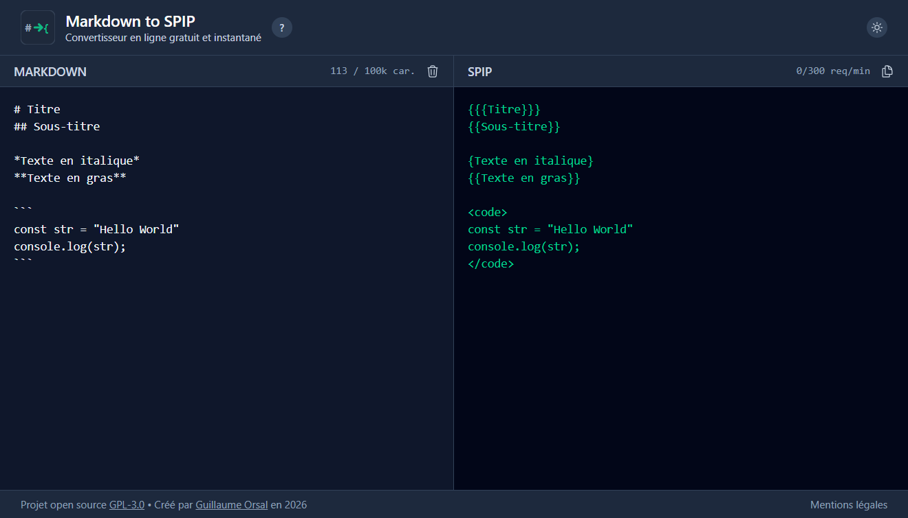

# Markdown to SPIP

[](LICENSE)
[](https://www.php.net/)
[](https://laravel.com/)
[](https://livewire.laravel.com/)

Real-time online converter from Markdown to SPIP syntax.

**[Live demo](https://markdown2spip.orsal.fr)**



## Features

- **Real-time conversion** (no "Convert" button)
- **Split-view interface**: Markdown on the left, SPIP on the right
- **One-click copy** to clipboard with visual feedback
- **Local persistence**: text saved to browser localStorage (no loss on navigation)
- **Live character counter**
- **Contextual help**
- **Responsive** (mobile/desktop)
- **Dark mode** by default

## Supported conversions

| Markdown | SPIP | Description |
|----------|------|-------------|
| `# Title` | `{{{Title}}}` | Main heading (h1 only) |
| `## Subtitle` | `{{Subtitle}}` | Subheadings (h2 to h6) in bold |
| `**bold**` or `__bold__` | `{{bold}}` | Bold text |
| `*italic*` or `_italic_` | `{italic}` | Italic text |
| `***bold+ita***` or `___bold+ita___` | `{{ { bold+ita } }}` | Combined bold and italic |
| `~~strike~~` | `<del>strike</del>` | Strikethrough text |
| `` `code` `` | `<code>code</code>` | Inline code |
| ` ```code``` ` or ` ```js code``` ` | `<code>code</code>` | Code blocks (language name stripped) |
| `[link](url)` | `[link->url]` | Hyperlinks |
| `- item` | `-* item` | Bullet lists |
| `> quote` | `<quote>quote</quote>` | Blockquotes |
| `Text[^1]` + `[^1]: note` | `Text[[note]]` | Footnotes |

**Notes:**
- Code block contents are protected and not transformed by other conversion rules.
- Code blocks may include a language name (```js, ```php, etc.) which is stripped automatically.
- The underscore `_` works exactly like the asterisk `*` for formatting.

## Local installation

```bash
git clone https://github.com/Gallyan/md2spip.git
cd md2spip
composer run setup
php artisan serve
```

Customize the `LEGAL_*` variables in `.env` (editor, hosting, contact). See `.env.example`.

## Production deployment

The `.github/workflows/pipeline.yml` workflow auto-deploys to the server after a successful test run on `main`. Required secrets are listed in the file's comments.

First-time server setup:

```bash
git clone <repo> /path/to/site
cd /path/to/site
composer install --no-dev --optimize-autoloader
cp .env.production .env
# edit APP_URL and LEGAL_* (editor, hosting, contact)
php artisan key:generate
npm ci && npm run build
php artisan optimize
```

## Tests

```bash
php artisan test
```

See the [CHANGELOG](CHANGELOG.md) for project history.

## Accessibility

- Full keyboard navigation
- ARIA support and screen readers

## Privacy

No user data is stored server-side. Everything stays in your browser.
